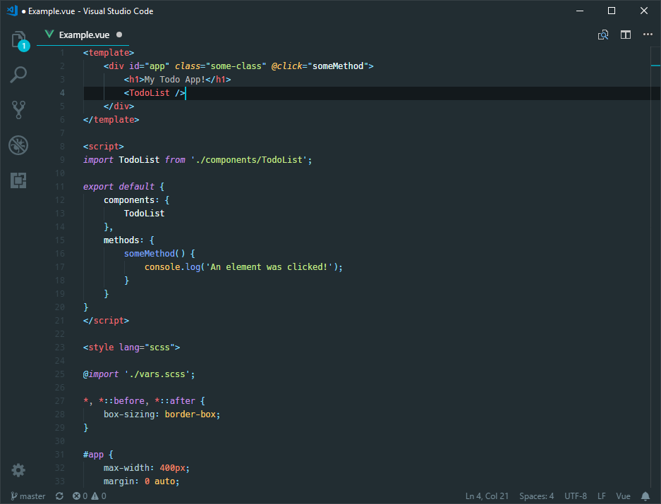

## Material Basic

Inspired by and derived from [Material Theme](https://github.com/equinusocio/material-theme), with a few additions and personal tweaks. 

This theme pack was originally created for personal use (mainly Laravel/Vue-focused), but suggestions/improvements are welcome.

#### Implemented variants
* Teal - Based on the original theme
* Cyan - Slightly darker background, cyan highlights
* Gray - Gray background, blue highlights

#### Tweaks/additions
* Html attributes in .vue and .blade.php files
* Highlight current line number
* Highlight current indent guide
* JS/PHP tokens more in line with the Sublime theme
* Less noisy docblocks
* And more...

Workbench is of course fully themed.
