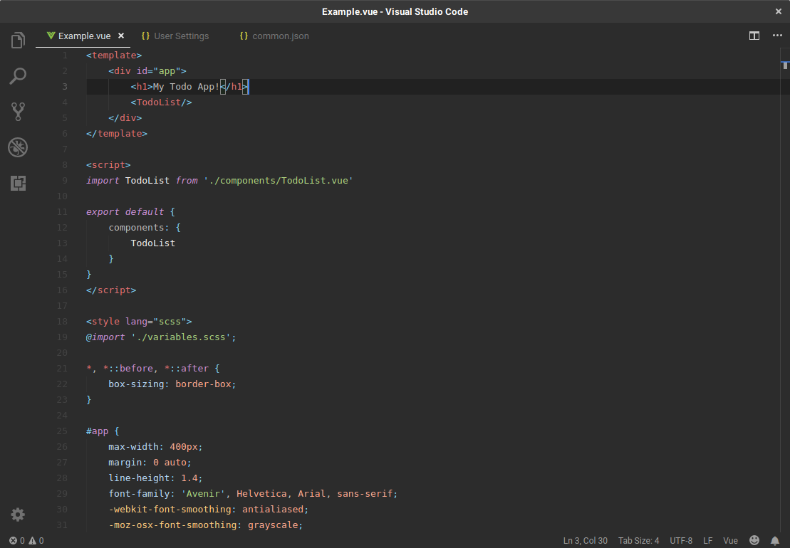

## Material Basic

Inspired by and derived from [Material Theme](https://github.com/equinusocio/material-theme), with a few additions and personal tweaks. 

This theme pack was originally created for personal use (mainly Laravel/Vue-focused), but suggestions/improvements are welcome.

#### Implemented variants
* Adapta - Based on the original theme, with background tweaked to match [Adapta GTK Theme](https://github.com/adapta-project/adapta-gtk-theme)
* Breeze - Tinted gray background, blue highlights. Made to fit KDE's Breeze Dark theme
* Materia - Gray background, blue highlights. Made to fit [Materia GTK Theme](https://github.com/nana-4/materia-theme)

#### Tweaks/additions
* Html attributes in .vue and .blade.php files
* Additional PHP and Vue scopes
* Highlight current line number
* Highlight current indent guide
* JS/PHP tokens more in line with the Sublime theme
* Less noisy docblocks
* And more...

Screenshot: *Materia variant*

Workbench is of course fully themed.

#### Contributors
[@MattMattV](https://github.com/MattMattV)

Thanks for the contributions!